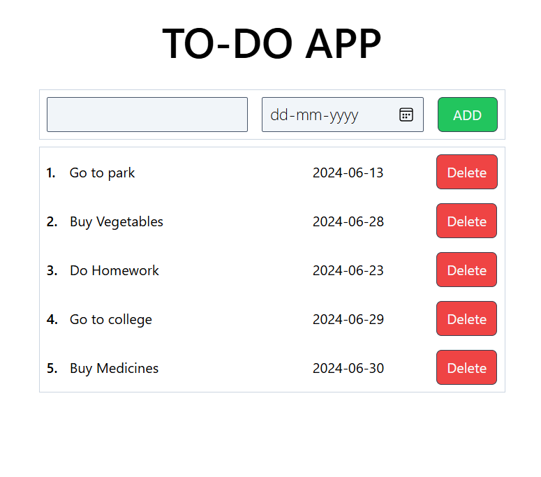

# ToDo App



## Table of Contents
- [Introduction](#introduction)
- [Features](#features)
- [React + Vite](#react--vite)
- [Installation](#installation)
- [Usage](#usage)
- [Contact](#contact)

## Introduction
The **ToDo App** is a simple yet functional task management application built using React and Vite, with Tailwind CSS for styling. This app allows users to add and remove tasks , helping them manage their daily activities efficiently.

## Features
- Add new tasks
- Delete tasks
- Responsive design

## React + Vite
This template provides a minimal setup to get React working in Vite with HMR and some ESLint rules.

Currently, two official plugins are available:
- [@vitejs/plugin-react](https://github.com/vitejs/vite-plugin-react/blob/main/packages/plugin-react/README.md) uses [Babel](https://babeljs.io/) for Fast Refresh
- [@vitejs/plugin-react-swc](https://github.com/vitejs/vite-plugin-react-swc) uses [SWC](https://swc.rs/) for Fast Refresh

## Installation
To run the **ToDo App** on your local machine, follow these steps:

1. **Clone the repository:**
    ```bash
    git clone https://github.com/yourusername/todo-app.git
    ```

2. **Navigate to the project directory:**
    ```bash
    cd todo-app
    ```

3. **Install dependencies:**
    ```bash
    npm install
    ```

4. **Start the development server:**
    ```bash
    npm run dev
    ```

## Usage
1. **Open your browser:**
    - Navigate to `http://localhost:3000` to view the app.

2. **Add a task:**
    - Use the input field to type in a new task and press enter or click the "Add" button.

3. **Manage tasks:**
    - Click on a task to mark it as complete/incomplete.
    - Click the delete button next to a task to remove it from the list.
## Contact
For any questions or feedback, please reach out to:

- **Email:** sumit.sati2508@gmail.com
- **GitHub:** [satisumit](https://github.com/satisumit)
